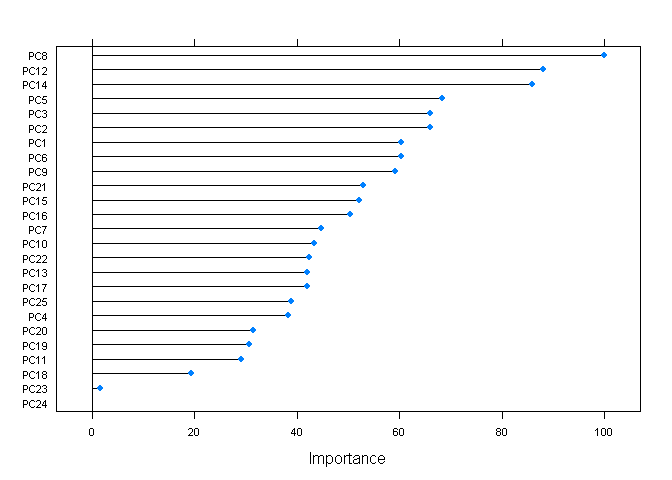

# Practical Machine Learning Course Project Writeup

*by Sergey Nikonov*

We have huge dataset from  quantified self movement devices and want to predict manner in which persons did the exercise.

Let's load the data and take a look at it.


```r
data <- read.csv(file="pml-training.csv", stringsAsFactors=F, sep=",")
dim(data)
```

```
## [1] 19622   160
```

```r
table(is.na(data))
```

```
## 
##   FALSE    TRUE 
## 1852048 1287472
```

Many variables, many NAs. Let's take out variables with NAs, near zero variance and not needed for prediction (perhaps).


```r
library(caret)
```

```
## Loading required package: lattice
## Loading required package: ggplot2
```

```r
data <- data[-nearZeroVar(data)]
nas <- sapply(data[,1:100], function(x) table(is.na(x))[1])
data <- data[, nas==19622]
data <- data[, c(-1,-3:-7)]
```

And what about correlation?


```r
table(symnum(cor(data[,c(-1, -53)])))
```

```
## 
##              *    ,    .    +    1    B 
## 1275 1059    5   35  166    7   51    3
```

```r
attr(symnum(cor(data[, c(-1, -53)])), "legend")
```

```
## [1] "0 ' ' 0.3 '.' 0.6 ',' 0.8 '+' 0.9 '*' 0.95 'B' 1"
```

Some preprocessing will be good.


```r
pre <- preProcess(data[c(-1, -53)], method="pca", thresh=0.95)
predata <- predict(pre, data[ c(-1, -53)])
```

Now we can take a look into preprocessed data. 25 variables are better than 160.


```r
qplot(predata[,1], predata[,2], color=data[,53])
```

 

We have 5 exellent clusters, but they look like a mess. It is person's clusters, may be.


```r
qplot(predata[,1], predata[,2], color=data[,1])
```

 

OK then. At least we can differentiate persons.

Seems like we can not divide "classe" in 2 dimensions, so let's algorithm do it for us.

```r
pairs(predata[,16:20], col=as.factor(data[,53]), pch=".")
```

 

I had two choices: a) use something strong as boosting or random forest o b) find something simple and accurate enough. After digging in caret models I found k-nearest neighbors. Let's try.


```r
library(caret)

data[,53] <- as.factor(data[,53])
tr <-  trainControl( method="cv", number=3, p=0.3)
tune <- data.frame(k=1:3)
fit <- train(y=data[,53], x=predata, tuneGrid=tune, trControl=tr, 
             method="knn" )
fit
```

```
## k-Nearest Neighbors 
## 
## 19622 samples
##    25 predictor
##     5 classes: 'A', 'B', 'C', 'D', 'E' 
## 
## No pre-processing
## Resampling: Cross-Validated (3 fold) 
## 
## Summary of sample sizes: 13081, 13082, 13081 
## 
## Resampling results across tuning parameters:
## 
##   k  Accuracy  Kappa  Accuracy SD  Kappa SD
##   1  1         1      5e-04        6e-04   
##   2  1         1      1e-03        1e-03   
##   3  1         1      2e-03        2e-03   
## 
## Accuracy was used to select the optimal model using  the largest value.
## The final value used for the model was k = 1.
```

```r
plot(varImp(fit), scales=list(cex=0.5))
```

```
## Loading required package: pROC
## Type 'citation("pROC")' for a citation.
## 
## Attaching package: 'pROC'
## 
## The following objects are masked from 'package:stats':
## 
##     cov, smooth, var
```

 

Hm. Exellent accuracy and Kappa. May be overfitting? Whatever. Create a prediction and compare to another.


```r
test <- read.csv(file="pml-testing.csv", stringsAsFactors=F, sep=",")
test <- test[,names(test) %in% names(data)]
pretest <- predict(pre, test[,-1])
preKnn <- predict(fit, pretest)
```

If it is a prediction, here must be a random forest. Just to make sure.


```r
library(doParallel)
```

```
## Loading required package: foreach
## Loading required package: iterators
## Loading required package: parallel
```

```r
tr <-  trainControl(method="cv", number=3,  p=0.3)

cl <- makePSOCKcluster(2)
clusterEvalQ(cl, library(foreach))
```

```
## [[1]]
## [1] "foreach"   "methods"   "stats"     "graphics"  "grDevices" "utils"    
## [7] "datasets"  "base"     
## 
## [[2]]
## [1] "foreach"   "methods"   "stats"     "graphics"  "grDevices" "utils"    
## [7] "datasets"  "base"
```

```r
registerDoParallel(cl)
fitRF <- train(y=data[,53], x=predata, trControl=tr,  method="parRF")
```

```
## Loading required package: randomForest
## randomForest 4.6-10
## Type rfNews() to see new features/changes/bug fixes.
```

```r
fitRF
```

```
## Parallel Random Forest 
## 
## 19622 samples
##    25 predictor
##     5 classes: 'A', 'B', 'C', 'D', 'E' 
## 
## No pre-processing
## Resampling: Cross-Validated (3 fold) 
## 
## Summary of sample sizes: 13081, 13080, 13083 
## 
## Resampling results across tuning parameters:
## 
##   mtry  Accuracy  Kappa  Accuracy SD  Kappa SD
##    2    1         1.0    0.003        0.004   
##   13    1         1.0    0.003        0.004   
##   25    1         0.9    0.003        0.004   
## 
## Accuracy was used to select the optimal model using  the largest value.
## The final value used for the model was mtry = 2.
```

```r
plot(varImp(fitRF), scales=list(cex=0.7))
```

 

```r
preRF <- predict(fitRF, pretest)
```

Notice size of fit (7.9 Mb) and fitRF (64.5 Mb).

And the moment of truth.


```r
confusionMatrix(predict(fit, predata), data$classe) 
```

```
## Confusion Matrix and Statistics
## 
##           Reference
## Prediction    A    B    C    D    E
##          A 5580    0    0    0    0
##          B    0 3797    0    0    0
##          C    0    0 3422    0    0
##          D    0    0    0 3216    0
##          E    0    0    0    0 3607
## 
## Overall Statistics
##                                 
##                Accuracy : 1     
##                  95% CI : (1, 1)
##     No Information Rate : 0.284 
##     P-Value [Acc > NIR] : <2e-16
##                                 
##                   Kappa : 1     
##  Mcnemar's Test P-Value : NA    
## 
## Statistics by Class:
## 
##                      Class: A Class: B Class: C Class: D Class: E
## Sensitivity             1.000    1.000    1.000    1.000    1.000
## Specificity             1.000    1.000    1.000    1.000    1.000
## Pos Pred Value          1.000    1.000    1.000    1.000    1.000
## Neg Pred Value          1.000    1.000    1.000    1.000    1.000
## Prevalence              0.284    0.194    0.174    0.164    0.184
## Detection Rate          0.284    0.194    0.174    0.164    0.184
## Detection Prevalence    0.284    0.194    0.174    0.164    0.184
## Balanced Accuracy       1.000    1.000    1.000    1.000    1.000
```

```r
confusionMatrix(predict(fitRF, predata), data$classe) 
```

```
## Confusion Matrix and Statistics
## 
##           Reference
## Prediction    A    B    C    D    E
##          A 5580    0    0    0    0
##          B    0 3797    0    0    0
##          C    0    0 3422    0    0
##          D    0    0    0 3216    0
##          E    0    0    0    0 3607
## 
## Overall Statistics
##                                 
##                Accuracy : 1     
##                  95% CI : (1, 1)
##     No Information Rate : 0.284 
##     P-Value [Acc > NIR] : <2e-16
##                                 
##                   Kappa : 1     
##  Mcnemar's Test P-Value : NA    
## 
## Statistics by Class:
## 
##                      Class: A Class: B Class: C Class: D Class: E
## Sensitivity             1.000    1.000    1.000    1.000    1.000
## Specificity             1.000    1.000    1.000    1.000    1.000
## Pos Pred Value          1.000    1.000    1.000    1.000    1.000
## Neg Pred Value          1.000    1.000    1.000    1.000    1.000
## Prevalence              0.284    0.194    0.174    0.164    0.184
## Detection Rate          0.284    0.194    0.174    0.164    0.184
## Detection Prevalence    0.284    0.194    0.174    0.164    0.184
## Balanced Accuracy       1.000    1.000    1.000    1.000    1.000
```

```r
all.equal(preRF, preKnn)
```

```
## [1] "1 string mismatch"
```

OK. Submission next. And good luck for all of us.
